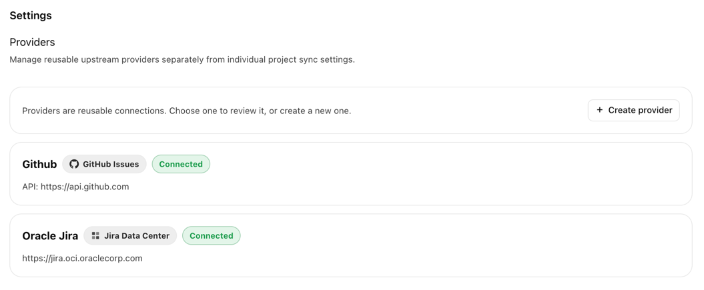

# paperclip-external-issues-plugin

External Issue Sync is a Paperclip plugin for teams that plan in Paperclip but still need Jira Data Center, Jira Cloud, or GitHub issues to remain the system of record.

Supports Jira Data Center and GitHub Issues with rigorous manual validation, plus Jira Cloud through the same shared provider architecture with implementation in place but no full end-to-end validation yet.

## Example

* Configure issue providers of the supported type:
  
* 

## Provider support

| Feature | Jira Data Center | GitHub Issues | Jira Cloud |
| --- | --- | --- | --- |
| Provider configuration | Supported, tested | Supported, tested | Supported, not yet fully validated |
| Project or repository mapping | Supported, tested | Supported, tested | Supported, not yet fully validated |
| Import and refresh external issues | Supported, tested | Supported, tested | Implemented, not yet fully validated |
| Create upstream issue from Paperclip | Supported, tested | Supported, tested | Implemented, not yet fully validated |
| Read and post comments | Supported, tested | Supported, tested | Implemented, not yet fully validated |
| Search and update assignees | Supported, tested | Supported, tested | Implemented, not yet fully validated |
| Read and update upstream status | Supported, tested | Supported, tested | Implemented, not yet fully validated |
| Project-scoped agent tools | Supported, tested | Supported, tested | Implemented, not yet fully validated |
| Overall provider confidence | Production-ready in this repo | Production-ready in this repo | Experimental until validated |

## What this repo contains

- a new sibling plugin package based on the GitHub sync plugin structure
- a smaller Jira-first worker that focuses on issue sync instead of pull-request workflows
- hosted UI for a provider-aware sync center, dashboard status, issue detail sync controls, and per-comment upload buttons
- a Paperclip integration proposal for a more native synced-vs-local issue experience

## Current shape

This version now has a fuller provider-aware sync flow:

- the hosted sync center lets users create reusable upstream providers, while project and issue sync surfaces configure one Paperclip project at a time
- the settings surface is now provider-only, and project-scoped sync opens on a dedicated page for the selected Paperclip project instead of mixing all project settings in one view
- each project page now groups configuration into tabs for essential settings, agent access, project mappings, and status mapping, while sync actions and status stay pinned at the bottom
- provider definitions live in plugin config so one upstream connection can be reused across many Paperclip projects
- provider config writes stay backward-compatible with older Paperclip host schemas by storing a legacy-safe outer shape while preserving the real provider kind for the plugin
- providers are managed on their own settings page, and each provider opens on its own detail page with `Back` navigation instead of a nested popup
- provider cards separate neutral metadata badges from live health, so saved tokens and provider type stay informational while connectivity shows as `Connected`, `Degraded`, `Not tested`, or `Needs config`
- each Paperclip project can opt selected agents into provider-agnostic upstream issue tools, so agent runs can read or update linked upstream issues only when that specific project allowlists their `agent.id`
- legacy single-provider config using `jiraBaseUrl`, `jiraUserEmail`, `jiraToken`, or `jiraTokenRef` still works as a migration path
- saved provider tokens stay hidden in the UI; users only enter a new token when they want to replace it
- each Paperclip project keeps its own selected provider, default assignee, default status, cadence, and Jira mappings inside plugin state
- the essential project tab owns the default upstream project or repository, and saving that value automatically keeps a primary mapping in place for the project
- GitHub-backed Paperclip projects can infer the default repository from the project's bound GitHub workspace, so GitHub issue sync setup starts with the existing project binding when available
- GitHub issue sync now preserves close reasons like `Completed`, `Not planned`, and `Duplicate` in the upstream status UI while still letting the default closed-family mapping resolve those issues locally without extra setup
- each Paperclip project can define a default Jira-to-Paperclip status plus explicit Jira status mappings such as `Done -> done`, and each mapping row can optionally assign a Paperclip agent or `None`
- a project can explicitly stay on `Provider: None`, which keeps it Paperclip-only while still allowing `Hide imported issues` for previously imported upstream work
- opening `Sync Issues` from a project or issue now scopes the modal to the current project, while the settings surface stays focused on provider management
- before a provider is selected on a project page, the only available action besides provider selection is `Hide imported issues`
- manual and scheduled sync report processed, total, imported, updated, skipped, and failed counts
- synced issues keep their Paperclip local status separate from Jira upstream status metadata
- when a project configures Jira-to-Paperclip status mappings, Jira import/pull/transition refreshes can also update the local Paperclip status to match the mapped workflow state
- issue detail only presents an issue as Jira-linked when the current Paperclip issue still carries its Jira sync markers, which avoids stale-link UI on fresh local issues
- pure local issues in configured projects now expose a `Create upstream issue` action, and synced issues use a stable `[JIRA-123]` title prefix fallback plus a visible `Open in Jira` action
- issue detail and sync controls now use Paperclip-style neutral icon-first buttons with subtler transparent backgrounds so dark mode matches the host styling more closely
- comments on Jira-linked issues show whether they were imported, published upstream, or still local to Paperclip
- synced issue detail now includes a collapsed Jira comments list above the composer
- synced issue detail always posts new comments on linked issues to Jira
- project sync settings prefill the default assignee from the current Jira user when possible and use Jira-backed autocomplete for the project default assignee plus mapping author and assignee filters
- synced issue detail now shows both the upstream Jira assignee and the upstream Jira creator, refreshed from live Jira issue data when available
- new mappings start with `Active only` enabled and default the assignee filter to the current Jira user for the selected provider when available
- the main `Sync issues` action saves project settings automatically before it runs
- `Hide imported issues` only targets the selected project and can hide imported upstream issues from active Paperclip views, even after later local sync activity
- the hide dialog still opens for an empty-state review, and hidden imported issues are restored automatically if the same upstream issue appears again on a later sync
- provider adapters now live behind a shared registry and typed capabilities so new trackers can be added without rewriting the sync shell
- Jira Data Center continues to use the checked-in generated OpenAPI client, while GitHub provider wiring uses the official Octokit client
- provider health is now stored per provider and refreshed by both explicit connection tests and successful or failed sync fetches

## Publishing

This package is prepared to publish to npm as `paperclip-external-issues-plugin`.

Release flow:

1. Run `pnpm typecheck`, `pnpm test`, and `pnpm build`.
2. Optionally run `npm pack --dry-run` to inspect the publish payload.
3. Create a GitHub Release with a semver tag such as `v0.1.2`.
4. The release workflow in [`.github/workflows/release.yml`](/Users/andriy/IdeaProjects/paperclip-jira-plugin/.github/workflows/release.yml) stamps the tag version, rebuilds, reruns checks, and publishes to npm with provenance.

Compatibility note:

- The npm package name is `paperclip-external-issues-plugin`.
- The installed Paperclip plugin id remains `paperclip-jira-plugin` so existing local installs and saved plugin state continue to work.

## Important note on Atlassian MCP

The Atlassian MCP available in this coding environment is great for development and for validating the workflow shape, but a deployed Paperclip plugin worker cannot directly call that MCP today.

That means the plugin implementation in this repo uses Jira-compatible REST credentials from Paperclip plugin config today. If Paperclip later grows a plugin-to-MCP bridge or a small Jira MCP proxy service, this plugin should swap that transport behind the worker helpers rather than changing the UI or sync model.

## Jira DC spec pipeline

This repo now includes a small Jira Data Center spec pipeline so we can stop hand-maintaining every REST shape:

- `pnpm jira:sync-spec --version <jira-version>` downloads `jira-rest-plugin.wadl` for that Jira DC version and converts it into a pinned OpenAPI artifact under `vendor/jira-dc/<jira-version>/`
- `pnpm jira:generate-client --version <jira-version>` generates a `typescript-fetch` client into `generated/jira-dc-client/<jira-version>/`

Example:

```bash
pnpm jira:sync-spec --version 9.12.0
pnpm jira:generate-client --version 9.12.0
```

Notes:

- the OpenAPI artifact is generated from Jira DC WADL, not from the Jira Cloud swagger
- the converter is intentionally conservative and focused on stable operation/path/request/response scaffolding
- some Jira endpoints, especially user search/picker behavior, may still need handwritten compatibility wrappers even after generation
- if `openapi-generator-cli` has not initialized its runtime yet in this checkout, run `pnpm exec openapi-generator-cli version-manager set 7.16.0` once before generating clients

## Planned next steps

- add richer Jira field mapping beyond summary, description, comments, and status
- support safer conflict handling so pull sync can avoid overwriting local Paperclip edits automatically
- support comment pull updates instead of only importing unseen Jira comments
- expand Jira Cloud and GitHub Issues from the shared provider platform to full parity with the current Jira Data Center workflow
- extend Paperclip core so issue lists can show synced/local state natively instead of only inside plugin surfaces
