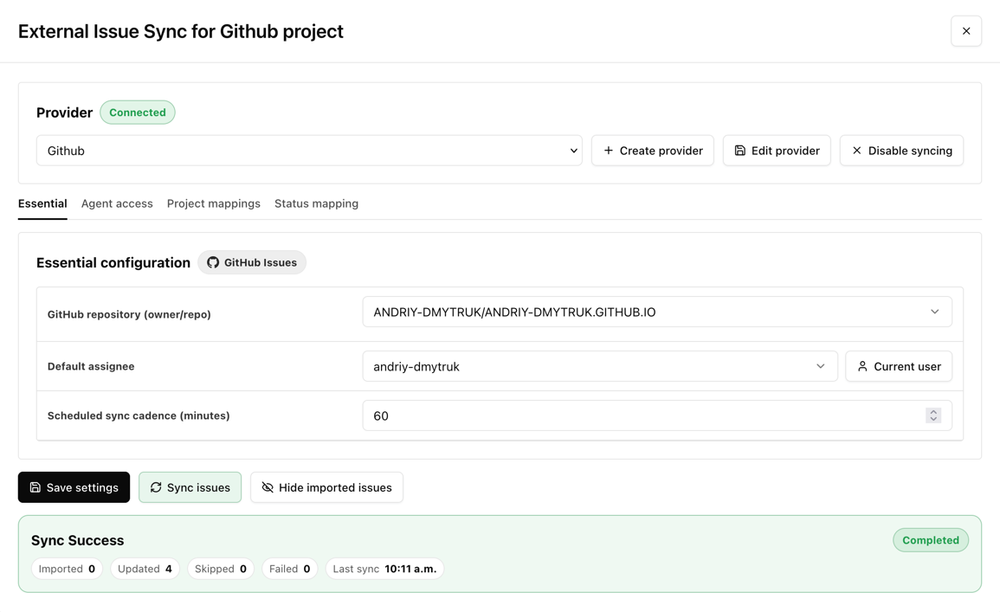
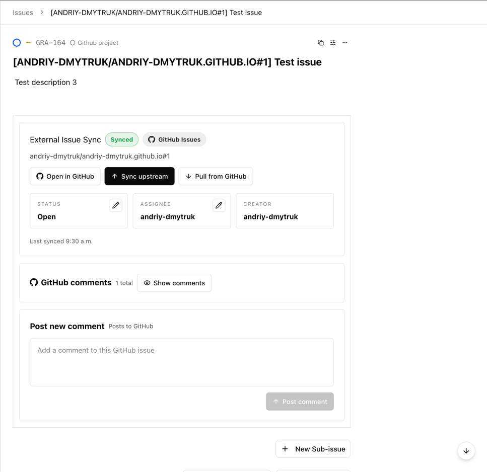

# paperclip-external-issues-plugin

Paperclip plugin for synchronizing external issues from Jira Data Center, Jira Cloud, and GitHub Issues into Paperclip.

## Quick Start and Experience

1. Add one or more providers in plugin settings.
  
2. Open a Paperclip project and choose the provider to use.
3. Configure sync. Set the default upstream project or repository and any mapping filters.
   
4. Run sync from the project.
5. Get upstream information in sync view 
  

## What It Does and Why

- Reuses saved issue providers across Paperclip projects.
- Configures sync per Paperclip project, including filters, mappings, status mappings, and agent access.
- Syncs issue metadata, comments, assignee, and status both ways where the provider supports it.
- Tracks sync health per project and provider.
- Supports cleanup of imported issues from within the project sync flow.
- Extensible provider model, so new issue providers can be added without reshaping the whole plugin.
- Minimal Paperclip surface area, focused on issue sync rather than broader project management.
- Strong project-level configurability, including mappings, filters, status mappings, and agent access.

## Support

| Capability | Jira Data Center | GitHub Issues | Jira Cloud |
| --- | --- | --- | --- |
| Configure provider | Tested | Tested | Implemented, not fully validated |
| Select upstream project or repository | Tested | Tested | Implemented, not fully validated |
| Import and refresh issues | Tested | Tested | Implemented, not fully validated |
| Create upstream issues | Tested | Tested | Implemented, not fully validated |
| Read and post comments | Tested | Tested | Implemented, not fully validated |
| Search and update assignee | Tested | Tested | Implemented, not fully validated |
| Read and update status | Tested | Tested | Implemented, not fully validated |
| Project-scoped agent tools | Tested | Tested | Implemented, not fully validated |

## Package Notes

- npm package: `paperclip-external-issues-plugin`
- Paperclip plugin id: `paperclip-external-issues-plugin`
- Main UI surfaces: settings page, project toolbar button, task detail view, comment annotation, dashboard widget
- Agent tools are registered statically and authorized at runtime per project and agent allowlist

## Development

- Build: `pnpm build`
- Tests: `pnpm test`
- Typecheck: `pnpm typecheck`
- Dev watch: `pnpm dev`

Run the usual local verification before publishing:

```bash
pnpm typecheck
pnpm test
pnpm build
```

## Publish

1. Verify `pnpm typecheck`, `pnpm test`, and `pnpm build`
2. Create a release tag such as `v0.1.2`
3. Publish through [`.github/workflows/release.yml`](./.github/workflows/release.yml)

## Jira Data Center OpenAPI

- Sync spec: `pnpm jira:sync-spec --version <jira-version>`
- Generate client: `pnpm jira:generate-client --version <jira-version>`

Example:

```bash
pnpm jira:sync-spec --version 9.12.0
pnpm jira:generate-client --version 9.12.0
```

## Attribution and License

This project is a derivative of [paperclip-github-plugin](https://github.com/alvarosanchez/paperclip-github-plugin) by Álvaro Sánchez-Mariscal.

- Original project license: Apache-2.0
- This project license: Apache-2.0
- License file: [LICENSE](./LICENSE)
